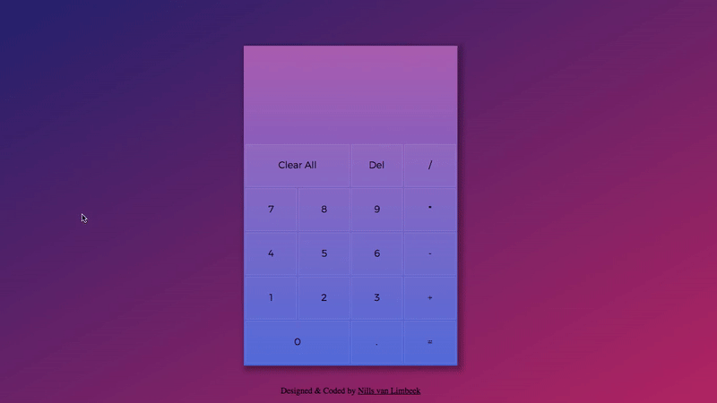
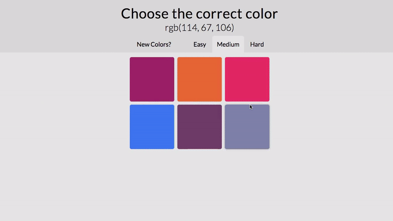
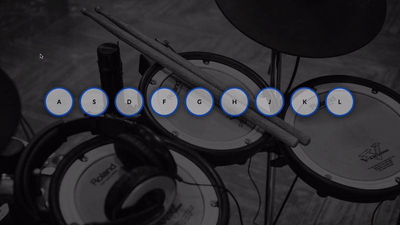
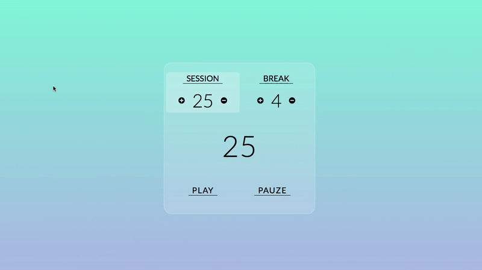
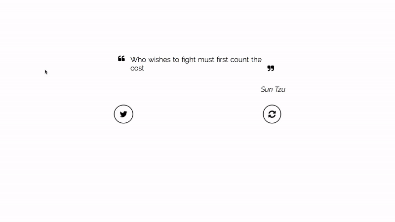
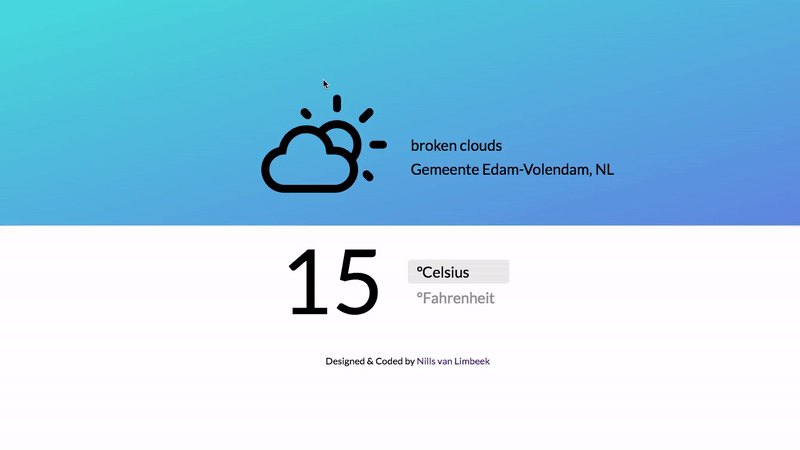

# JavaScript-Projects

This is a list of my finished JavaScript Projects.

Take a look and tell me what you think.

## Calculator
https://nillsvanlimbeek.github.io/calculator/

A FreeCodeCamp assignment. Build a fully functional calculator in JavaScript.

### User Story
* User can add, subtract, multiply and divide two numbers.
* User can clear the input field with a clear button.
* User can keep chaining mathematical operations together until I hit the equal button, and the calculator will tell the correct output.

## Color Guessing Game
https://nillsvanlimbeek.github.io/color_guessing_game/

Try and guess the color based on the RGB index on top of the page.

### User Story
* User can click on the colored squares.
* User can choose three different game modes (easy, medium and hard).
* The game updates based on the input of the User.

## Drum Kit
https://nillsvanlimbeek.github.io/drum_kit/

Make some noise!

### User Story
* User can press a button on the keyboard and a sounds plays

## Pomodoro Clock
https://nillsvanlimbeek.github.io/pomodoro/

A FreeCodeCamp assignment. Build a working pomodoro clock in JavaScript.

### User Story
* User can start a 25 minute pomodoro, and the timer will go off once 25 minutes has elapsed.
* User can reset the clock for the next pomodoro.
* User can customize the length of each pomodoro.

## Quote Machine
https://nillsvanlimbeek.github.io/quote_generator/

A FreeCodeCamp assignment. Build a app that randomly shows quotes.

### User Story
* User can click a button to show me a new random quote.
* User can press a button to tweet out a quote.

## Weather App
https://nillsvanlimbeek.github.io/weather_app/

A FreeCodeCamp assignment. Build a weather app that shows the weather in the users location.

### User Story
* User can see the weather in the current location.
* User can see a different icon or background image depending on the weather.
* User can push a button to toggle between Fahrenheit and Celsius.

